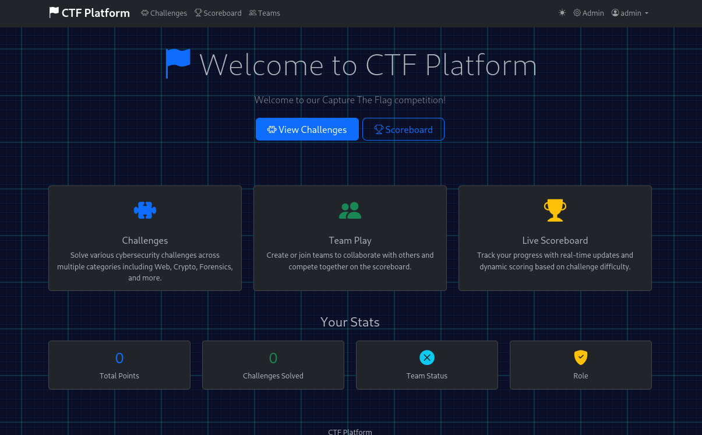
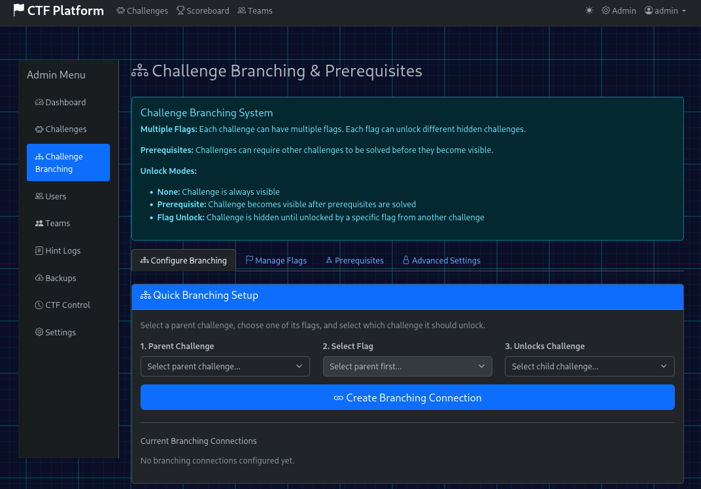
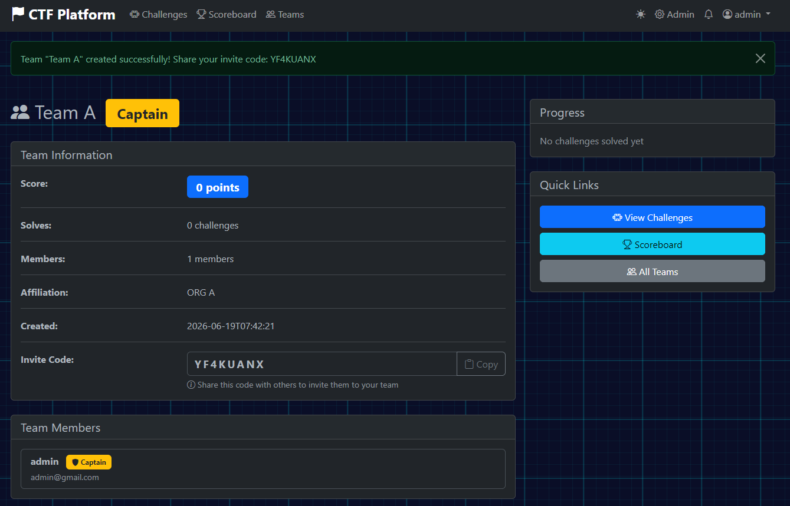
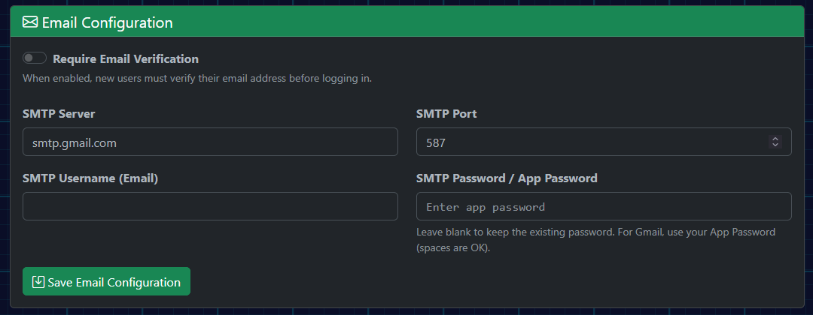
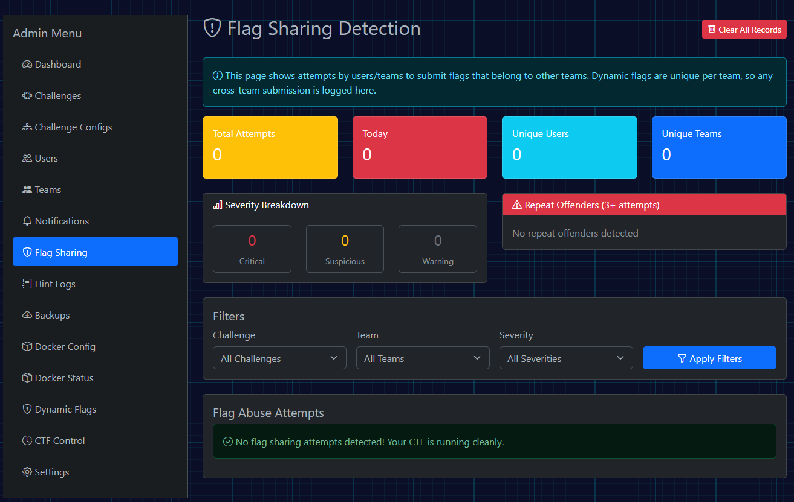
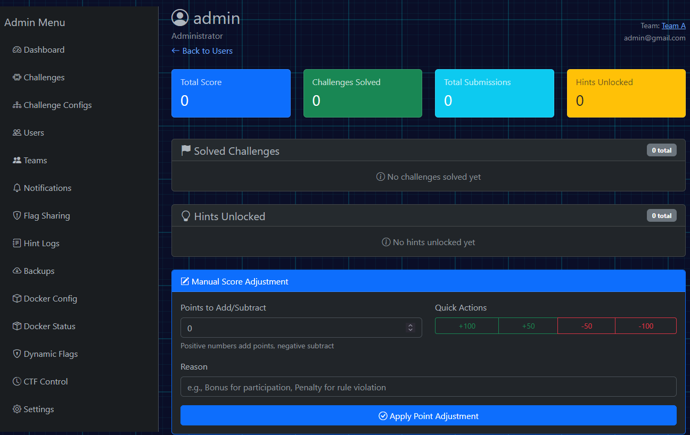
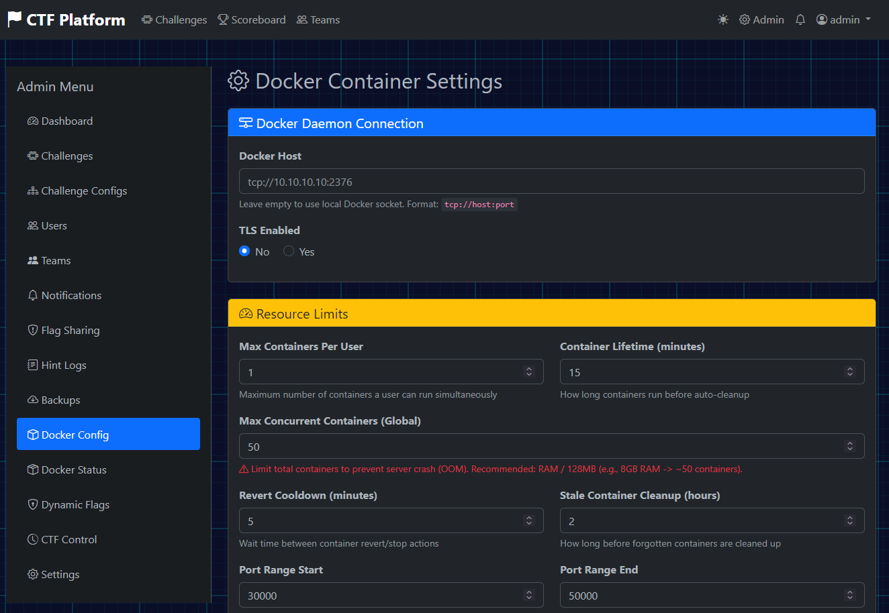

# BlackBox CTF Platform

<div align="center">


A modern, feature-rich Capture The Flag (CTF) platform built with Flask, designed for hosting cybersecurity competitions with advanced challenge management, dynamic Docker-based challenges, real-time scoring, and comprehensive admin controls.

[Features](#features) • [Quick Start](#quick-start) • [Installation](#installation) • [Docker Integration](#docker-integration) • [Usage Guide](#usage-guide) • [Configuration](#configuration) • [Contributing](#contributing)

</div>

---


## Features

### Core Functionality

#### Challenge Management
- **Multiple Challenge Types**: Web, Crypto, Forensics, Reverse Engineering, Binary Exploitation, OSINT, etc.
- **Dynamic Scoring**: Point values adjust based on solve count with **logarithmic** (smooth decay) or **parabolic** (CTFd-style) decay functions
- **Static Scoring**: Fixed point values for traditional CTF format
- **First Blood Bonus**: Configurable bonus points for first solver
- **File Attachments**: Upload challenge files with automatic hashing and integrity verification
- **Challenge Images**: Add inline images to challenge descriptions 
- **Connection Info**: Display SSH/netcat/web URLs for remote challenges
- **Challenge Flags**: Support for multiple flags per challenge (primary + alternative)
- **Case-Insensitive Flags**: Optional flag matching configuration

#### Advanced Challenge Features



- **Challenge Branching & Prerequisites**:
  - Set prerequisite challenges that must be solved first
  - Flag-based unlocking (solving challenge A with specific flag unlocks challenge B)
  - Simple branching (linear progression)
  - Complex branching (multiple paths and dependencies)
  - Visual dependency graph in admin panel

#### Hint System
- **Progressive Hints**: Multiple hints per challenge with point costs
- **Hint Prerequisites**: Hints can require previous hints to be unlocked first
- **Cost Deduction**: Automatic point deduction from team/user score
- **Unlock History**: Track who unlocked which hints and when
- **Admin Hint Logs**: Comprehensive logging of all hint unlocks with filtering

#### Team System
- **Flexible Team Modes**
  - Solo mode (individual competition)
  - Team mode (collaborative solving)
  - Optional teams (mix of solo and team players)
- **Team Management**:
  - Create teams with invite codes
  - Join teams via invite code or captain approval
  - Team size limits (configurable)
  - Team captain controls
  - Kick members
  - Leave team functionality



- **Team Scoring**: Aggregate team scores with solve tracking
- **Team Profiles**: View team members, solves, and statistics

#### User Management & Authentication
- **Flexible Registration & Auth**: Optional user registration (can be disabled at any stage) with Flask-Login and secure logout
- **Email Verification**: Option to require new users to verify their email address before logging in, with verification links sent via email
- **Password Recovery**: Secure password reset flow using time-sensitive confirmation tokens sent via email
- **User Profiles**: Detailed solve history, unlocked hints, and team membership stats
- **Admin Roles**: Dedicated admin panel with complete platform controls
- **Password Security**: Bcrypt password hashing




### Scoring & Competition

#### Real-Time Scoreboard
- **Live Updates**: WebSocket-based real-time score updates
- **Solve Timeline**: Visual timeline of challenge solves
- **Scoreboard Visibility**: Admin can hide/show scoreboard to users

#### Submission Tracking
- **Attempt Limits**: Optional rate limiting for flag submissions
- **Solve Tracking**: Record solve times, user/team, and points awarded
- **Manual Point Adjustments**: Admins can manually adjust scores with reason logging
- **Solve History**: View all solves with timestamps and point values
- **User Activity**: Comprehensive solve and hint unlock logs per user

#### CTF Control
- **Scheduled Events**: Set start and end times for competition
- **Timezone Support**: Full timezone configuration (16 common timezones)
- **Pause/Resume**: Pause submissions without ending the CTF
- **Always-On Mode**: Run continuous CTF without time limits
- **Countdown Timer**: Automatic countdown page before event starts

### User Interface

#### Modern Design
- **Bootstrap 5**: Responsive, mobile-friendly interface
- **Custom Backgrounds**: Animated gradient backgrounds with live preview. Admins can create custom background animations using HTML and CSS.

#### Admin Panel
- **Dashboard**: Overview of platform stats, recent activity
- **Challenge Manager**: 
  - Create/edit/delete challenges
  - Bulk operations
  - Visual branching editor
- **User Management**: View users, adjust points, track activity
- **Team Management**: Manage teams, adjust scores, view members
- **Hint Management**: Create/edit/delete hints, view unlock logs
- **Settings**: Configure platform, event details, branding
- **CTF Control**: Manage competition timing and status
- **Backup System**: Automated and manual backups
- **Anti-Cheat System**: Use dynamic flags (unique flags for each team/player) or regex based matching to detect flag sharing between players



### Security Features

#### Application Security
- **CSRF Protection**: Flask-WTF CSRF tokens on all forms
- **Security Headers**: 
  - Content Security Policy (CSP)
  - X-Content-Type-Options
  - X-Frame-Options
  - Strict-Transport-Security
  - X-XSS-Protection
- **SQL Injection Prevention**: SQLAlchemy ORM with parameterized queries
- **XSS Protection**: Template auto-escaping with Jinja2
- **Password Security**: Bcrypt hashing with salts
- **Session Security**: 
  - HTTPOnly cookies
  - Secure cookies (HTTPS)
  - SameSite protection
  - Configurable session lifetime

#### File Upload Security
- **File Type Validation**: Whitelist of allowed extensions
- **Size Limits**: Configurable max upload size (default 50MB)
- **Secure Filenames**: Werkzeug secure_filename sanitization
- **Hash Verification**: SHA256 checksums for file integrity
- **Isolated Storage**: Files stored outside web root

### Performance & Scalability

- **Redis Caching**: Distributed caching for high availability
- **Connection Pooling**: Configurable pool size and overflow
- **Query Optimization**: Indexed columns for fast lookups


### Flag Sharing & Abuse Detection

- **HMAC-Based Dynamic Flags**:
   - Dockerized challenges can use per-team dynamic flags generated using cryptographically secure HMAC-SHA256 signatures. When a container is started for a team (or individual in solo mode), the platform generates a unique, deterministic flag using a derived challenge key and the team/user identifier. The flag is injected into the running container at the path configured by the challenge admin (`docker_flag_path`). This prevents flag sharing between teams while allowing team members to share, without storing the flags in the cache or database.
   - The flags are verified deterministically via HMAC validation, ensuring they stay constant for a team/user throughout the entire competition.
- **Flag-sharing Detection and Admin Visibility**:
   - If a user submits a dynamic flag that belongs to a different team or user, the submission handler automatically detects it and records a `FlagAbuseAttempt` in the database.
   - Administrators can review these attempts in the **Admin → Flag Sharing** page, including submitter details, claimed owner, challenge, IP address, and human-readable owner names to detect intentional sharing.
- **Database Schema Helper (Self-healing Migrations)**:
   - Startup logic executes an idempotent schema helper (`scripts/db_schema.py` / `ensure_docker_schema` at startup) that automatically creates missing columns/tables for Docker and flag-abuse features, ensuring seamless database upgrades.
- **Container Lifecycle & Permission Hardening**:
   - The container injection logic ensures target paths exist, writes flag files with appropriate permissions, and runs a best-effort `chmod` inside containers to avoid permissions issues.
   - Background container reconciliation runs every 60 seconds to automatically prune stuck containers or expired sessions. Admins can also force-clean containers from the admin UI.


#### Platform Configuration
- **Event Settings**:
  - CTF name and description
  - Logo upload
  - Registration toggle
  - Team mode toggle
  - Scoreboard visibility
  - First blood bonus
- **System Settings**:
  - Platform Base URL (used for generating absolute password reset and email verification links)
  - Timezone configuration (16 timezones supported)
  - Email SMTP Server settings (SMTP Server, Port, Username, Password)
  - Backup frequency and automatic backup scheduling
- **Custom Theming**:
  - Custom CSS backgrounds
  - Live preview
  - Example templates (gradients, matrix, cyber grid, starfield)
  - Safe CSS validation

#### Monitoring & Logs
- **Health Check Endpoint**: Database and Redis status monitoring
- **User Activity Logs**: Track all user actions and submissions
- **Hint Unlock Logs**: Comprehensive hint unlock history
- **Solve History**: Detailed solve timeline with points
- **Admin Actions**: Logged point adjustments with reasons



### Internationalization

#### Timezone Support
- **Platform Timezone**: Configure global timezone (default UTC)
- **Supported Timezones**:
  - UTC
  - US: Eastern, Central, Mountain, Pacific
  - Europe: London, Paris, Berlin, Moscow
  - Asia: Dubai, Kolkata, Shanghai, Tokyo, Singapore
  - Pacific: Sydney, Auckland
- **Timezone Conversion**: All timestamps display in configured timezone
- **CTF Scheduling**: Set start/end times in platform timezone
- **Backup Times**: Scheduled backups respect timezone
- **User Activity**: All logs show times in platform timezone

---

## Quick Start

### Prerequisites
- Docker & Docker Compose
- Git

### Installation (Docker - Recommended)

```bash
# Clone the repository
git clone https://github.com/Unknnownnn/Blackbox.git
cd Blackbox
chmod +x docker-entrypoint.sh enable_docker.sh

# Configure environment (optional but recommended)
cp .env.example .env
nano .env

# Start services
docker compose up -d --build

# View logs
docker compose logs -f blackbox

# Stop services
docker compose down

# Access the platform
# Web: http://localhost:8000
# Admin setup: http://localhost:8000/setup
```

That's it! The platform will be running with:
- Flask application on port 8000
- MariaDB database
- Redis cache

### First-Time Setup

1. **Navigate to Setup Page**: http://localhost:5000/setup
2. **Create Admin Account**:
   - Username: `UniqueAdminUsername`
   - Email: `YourEmail@example.com`
   - Password: (your secure password)
3. **Configure Event**:
   - CTF Name
   - Description
   - Upload logo (optional)
4. **Set Timezone**: Admin → Settings → System Settings
5. **Configure CTF Schedule**: Admin → CTF Control

---

## Installation

### Recommended Production Deployment (Best Practice)

For hosting a live CTF event, the **best and most secure** way to deploy the platform is to:
1. **Provision a Dedicated VM** on a Virtual Private Server (VPS) provider (such as DigitalOcean, AWS, GCP, or Linode).
2. **Deploy via Docker Compose**: Running the application inside Docker containers ensures isolated, stable runtimes for the Flask web application, MariaDB database, and Redis cache.
3. **Isolate Challenge Containers**: Since the platform dynamically spawns isolated Docker containers for participant challenges, hosting on a dedicated VPS VM protects your private/local network infrastructure and allows you to enforce clean CPU, memory, and networking limits.

To deploy:
1. SSH into your VPS VM.
2. Install Docker and the Docker Compose plugin.
3. Follow the steps in the **[Quick Start](#quick-start)** section to clone, configure, and spin up the containerized stack.

### Manual Installation for Development

```bash
# Clone repository
git clone https://github.com/Unknnownnn/Blackbox.git
cd Blackbox

# Create virtual environment
python -m venv venv
source venv/bin/activate  # On Windows: venv\Scripts\activate

# Install dependencies
pip install -r requirements.txt

# Set up database
# Install MariaDB/MySQL and Redis

# Edit .env with your database and Redis credentials
cp .env.example .env

# Start the application
python app.py

# Or with Gunicorn (production)
gunicorn -c gunicorn.conf.py app:app
```


## Docker Integration

The platform supports dynamic, isolated Docker-based challenges that spin up a dedicated container instance on-demand for each team (or individual in solo mode) when they click "Start Instance" and automatically shut down when the timer expires or when they are stopped.

### Enabling Docker Integration

To enable and configure Docker-based challenges, use the provided helper script:

```bash
# Make the helper scripts executable (if not already done)
chmod +x enable_docker.sh get_docker_gid.sh

# Run the helper script to configure permissions and restart the services
./enable_docker.sh
```

The script performs the following:
1. Detects the GID of `/var/run/docker.sock` on the host to configure socket permissions.
2. Rebuilds the `blackbox` container to map the docker group GID.
3. Restarts the container stack with the socket mounted.
4. Verifies that the Docker CLI inside the container can communicate with the host's Docker daemon.
5. Runs necessary database migrations to create the `docker_settings` and `container_instances` tables.

---
### Step-by-Step Configuration Guide

#### 1. Build your Challenge Images
Admins can build their custom challenge Docker images on the host machine. Make sure to tag them appropriately:
```bash
docker build -t ctf-web-basic:v1 challenge-examples/web-basic/
```

#### 2. Configure Settings in the Admin Panel
Navigate to the platform and log in as an administrator:
1. Go to **Admin → Docker → Settings** (or visit `/admin/docker/settings`).
2. **Docker Host**: Leave empty to connect via the default local Unix socket (`/var/run/docker.sock`).
3. **Use TLS**: Uncheck.
4. **Repository Whitelist**: Add a comma-separated list of images allowed to be run (e.g., `ctf-web-basic`).
5. Save settings.



#### 3. Create a Docker-Enabled Challenge
When creating or editing a challenge:
1. Scroll down to the **Docker Settings** section and check **Docker Enabled**.
2. **Docker Image**: Select from the dropdown (or select *Custom* and type the image tag, e.g. `ctf-web-basic:v1`).
3. **Connection Info Template**: Enter the format for the participant to connect, e.g., `http://{host}:{port}` or `nc {host} {port}`.
4. **Docker Flag Path** (Optional): Specify the absolute path inside the container where the dynamic flag should be written (e.g., `/flag.txt` or `/var/www/html/flag.txt`). If provided, the system will inject the unique HMAC-based flag into that file upon container startup.

#### 4. Container Reconciliation & Pruning
- **Automatic Pruning**: A background thread runs every 60 seconds to clean up expired container sessions.
- **Admin Control**: Active container instances can be monitored and stopped/deleted under **Admin → Docker → Status**.
- **User Control**: Participants can start/stop their instance directly from the challenge page, or trigger a **Force Cleanup** if their container gets into a stuck/error state.

---


## Usage Guide

### For Participants

#### Getting Started
1. **Register**: Create an account (if registration is enabled)
2. **Join/Create Team**: If team mode is enabled
3. **Browse Challenges**: Navigate to Challenges page
4. **View Challenge**: Click on a challenge to see details
5. **Submit Flag**: Enter the flag and submit
6. **Use Hints**: Unlock hints if you're stuck (costs points)
7. **Track Progress**: View scoreboard and your profile

#### Solving Challenges
- Each challenge has a category, difficulty, and point value
- Some challenges may have file attachments to download
- Connection info provided for remote challenges
- Some challenges may require to connect to a isolated docker container which spins up once challenge is opened and stops once challenge is closed.
- Multiple flags may be accepted (case-insensitive option)
- First blood bonus awarded to first solver

### For Administrators

#### Creating Challenges
1. **Admin Panel → Challenges → Create Challenge**
2. **Fill Basic Information**:
   - Challenge name
   - Category (Web, Crypto, Forensics, etc.)
   - Difficulty (Easy, Medium, Hard, Expert)
   - Description (supports Markdown)
3. **Add Challenge Images** (optional):
   - Upload images to display in description
   - Images appear below description text
4. **Set Scoring**:
   - Static: Fixed points
   - Dynamic: Points decrease with solves
5. **Add Flags**:
   - Primary flag (required)
   - Alternative flags (optional)
   - Case-sensitive toggle
6. **Upload Files** (optional):
   - Challenge files for participants
   - Automatic hash generation
7. **Connection Info** (optional):
   - SSH, netcat, or web URLs
8. **Configure Hints** (optional):
   - Create progressive hints
   - Set point costs
   - Add hint prerequisites
9. **Set Branching** (optional):
   - Add prerequisites
   - Configure flag-based unlocking

#### Managing the CTF
- **Start/Stop**: Set start and end times in CTF Control
- **Pause/Resume**: Temporarily pause submissions
- **Monitor**: Dashboard shows recent activity
- **Adjust Scores**: Manual point adjustments with logging
- **View Logs**: Track all user activity and solves
- **Backups**: Automated backups with restore capability

---

## Configuration

### Platform Settings

Access via **Admin → Settings**:

1. **Event Configuration**:
   - CTF Name
   - Description
   - Logo
   - Registration toggle
   - Team mode toggle
   - First blood bonus
   - Scoreboard visibility

2. **System Settings**:
   - Timezone (16 options)
   - Backup frequency
   - Last backup time

3. **Custom Background**:
   - Enable custom CSS
   - Choose from templates
   - Live preview

### CTF Control

Access via **Admin → CTF Control**:

- **Schedule**: Set start and end times
- **Pause/Resume**: Quick control buttons
- **Status**: View current CTF state
- **Clear Schedule**: Remove time limits

### Backup Configuration

Access via **Admin → Backups**:

1. **Manual Backup**: Create instant backup
2. **Automatic Backups**: Configure frequency
   - Disabled
   - Hourly (at :00)
   - Daily (2:00 AM)
   - Weekly (Sunday 2:00 AM)
   - Monthly (1st of month, 2:00 AM)
3. **Restore**: Restore from any backup
4. **Download**: Export backup files

## Contributing

Contributions are welcome! If you'd like to help improve the BlackBox CTF Platform, please follow these steps:
1. Fork the repository.
2. Create a feature branch (`git checkout -b feature/amazing-feature`).
3. Commit your changes (`git commit -m 'Add some amazing feature'`).
4. Push to the branch (`git push origin feature/amazing-feature`).
5. Open a Pull Request.

---

[Back to Top](#blackbox-ctf-platform)
